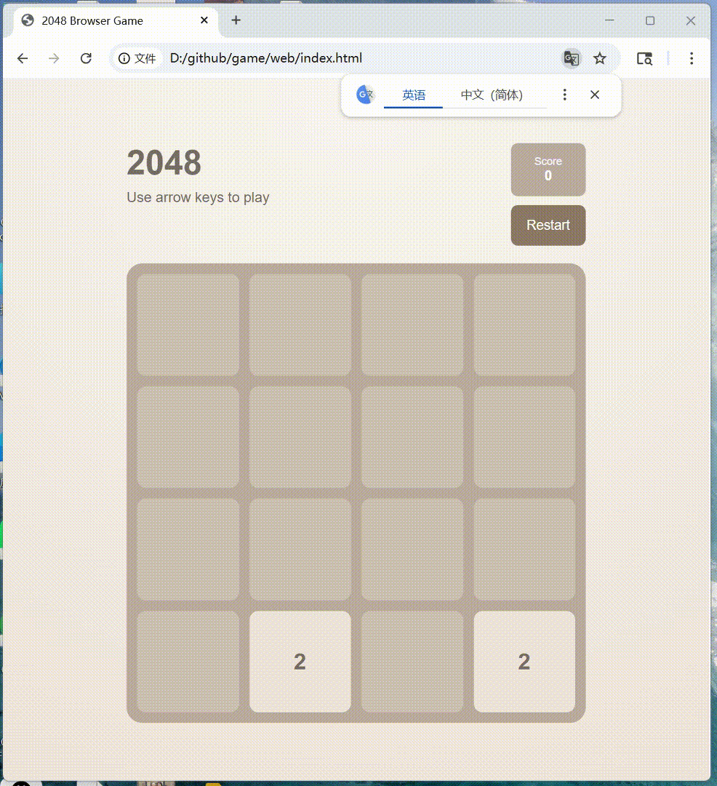

# Python Playwright on 2048

This project contains automated UI tests for the browser-based game 2048, built with pytest and Playwright.

The tests simulate real user interactions (keyboard inputs and button clicks) to verify core game functionality.
## Features
* Page loads with correct title and layout
* Initial tiles are generated
* Score updates after moves
* Restart button resets the game
* Game over message is displayed correctly

## Example: Game Over Test
The test simulates gameplay by sending arrow key inputs until no moves are possible. It then verifies that the Game Over message appears.

The GIF below shows the automated interaction and detection of the game over condition.



## Setup

1. Create a virtual environment:
```bash
python -m venv venv
source venv/bin/activate  # On Windows: venv\Scripts\activate
```

2. Install dependencies:
```bash
pip install -r requirements.txt
```

3. Install browser binaries:
```bash
playwright install
```

